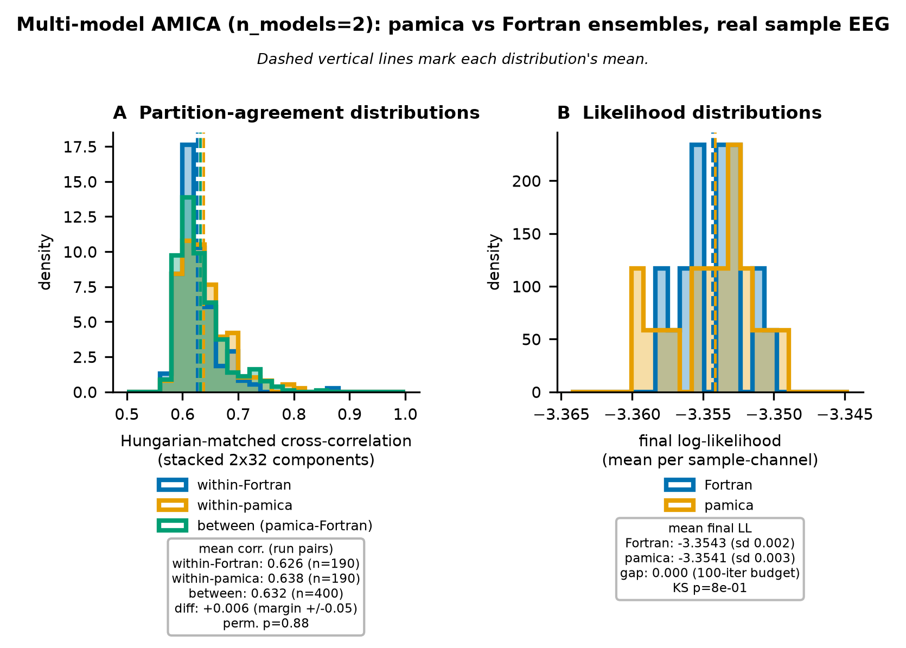

# Validation & Parity

**Correctness in pamica is defined as parity with the reference Fortran binary,
not merely as convergence.** A run is correct when it reproduces the Fortran output within numerical tolerance.
This page collects the full verification evidence: bit-exact score functions, single-model parity,
multi-model distributional similarity, cross-platform device and precision invariance,
the EEGLAB drop-in round-trip, and the remaining validated behaviors.
Every result uses real EEG and the reference Fortran binary; none uses synthetic data.
The multi-model and score-function checks use only the bundled EEGLAB tutorial sample (32 channels,
30504 samples at 128 Hz, ~238 s); the single-model headline additionally uses an external recording
(OpenNeuro ds002718 sub-002, 70 channels) at $k=\text{frames}/\text{channels}^2\approx153$, well past
the ~60 threshold where cross-backend agreement plateaus (below), since the bundled sample sits at
that threshold's boundary ($k\approx30$). Extending to a multi-subject, multi-dataset validation is
planned future work, not yet done.
Throughout, IC abbreviates independent component and LL log-likelihood.

## Validation at a glance

| What was checked | How | Result |
|---|---|---|
| Source-density score and log-density (non-GG families) | vs the literal `amica15.f90` expressions | bit-exact ($<10^{-12}$) |
| Per-block sufficient statistics and one M-step | vs Fortran | bit-exact ($\sim\!10^{-15}$) |
| Single-model solution (`do_newton=0`, $k\approx153$) | log-likelihood, component correlation vs Fortran | LL within ~0.0005 of $-3.6993$; correlation 0.998 |
| Single-model solution (`do_newton=0`, bundled, $k\approx30$) | Amari distance vs Fortran | 0.006 |
| Multi-model solution | distributional similarity over 20-run ensembles | indistinguishable from Fortran's own run-to-run spread ($p = 0.96$) |
| Device and precision invariance | same independent components across CPU/CUDA/MPS/MLX, float32/float64, Linux/macOS | identical (1.000) across all eight torch/MLX combinations |
| Cross-backend log-likelihood | converged LL across every backend | agree to ~3 significant digits (max pairwise ~0.003) |
| EEGLAB output | `write_amica_output` round-trip through `loadmodout15` | single-model bytes are an exact serialization; loads with correct layout |
| Degenerate fits | NaN or singular log-likelihood | refused, never returned as NaN sources |

## The validation harness

`validate_implementations.py` runs the implementations on real sample EEG,
matches components across implementations with the Hungarian algorithm,
and reports log-likelihood and per-component correlation. It always uses real sample data and the Fortran binary, never synthetic data.
Conformity with Fortran is measured with two metrics used throughout this page: Hungarian-matched component correlation,
and the Amari distance (`amari_distance` in `validate_implementations.py`),
a standard unmixing-matrix comparison metric (Amari, Cichocki & Yang, 1996) that is permutation- and scale-invariant by construction and so needs no assignment step.

## Single-model parity

With Newton disabled (`do_newton=0`), the natural-gradient backend reaches Fortran's solution,
averaged over 5 seeds at a matched 2000-iteration budget. The headline correlation is measured on an
external, unambiguously well-determined recording (OpenNeuro ds002718, 70 channels, $k\approx153$) so
it is not sensitive to whether a particular small dataset happens to be well-conditioned; the bundled
32-channel sample ($k\approx30$, at the project's own data-adequacy boundary) gives a consistent Amari
distance:

- Log-likelihood ~ -3.6993 ($k\approx153$; Fortran ~ -3.6993, gap ~0.0003).
- Hungarian-matched component correlation ~0.998 ($k\approx153$; Fortran-vs-Fortran self-consistency
  over the same 5 seeds: ~0.999), clearing the >0.95 gate. On the bundled sample ($k\approx30$) both
  numbers are consistent: ~0.998 pamica-vs-Fortran, ~0.998 Fortran-vs-Fortran.
- Amari distance ~0.006 (bundled sample; Fortran-vs-Fortran: ~0.005).

The fixed source-density families are bit-exact against the literal Fortran score/derivative expressions (~1e-15),
and the backend converges to the binary's solution within ~0.005 log-likelihood on either dataset.

### Newton-enabled runs and the initialization basin

The comparison above disables Newton (`do_newton=0`) to isolate the algorithm from its starting point.
With Newton enabled (`do_newton=1`, the default), agreement at the full 2000-iteration budget depends on the initialization, not on any dynamics difference between the backends.
From an *identical* initialization (the same starting mixing matrix and densities fed to both), `pamica` and Fortran converge to the same solution:
mean Hungarian-matched correlation ~0.997 with no collapsed components on the full 70-channel recording, the residual being floating-point summation-order noise between two implementations rather than an algorithmic gap.
From *independent* random initializations the picture differs, because the two backends' random number generators do not share a state, so a fixed seed does not map to a matched start.
At the long Newton budget this occasionally settles a few of the weakest, under-determined components into a different but equally likely (equal- or higher-likelihood) optimum.
Fortran is more robust to its own random inits (run-to-run self-consistency ~0.9997) than `pamica` is, so the effect appears as a `pamica`-specific spread on those components, not a divergence from the reference.
It is therefore an initialization-basin property (like the non-identifiable multi-model case below), not a parity defect; see issue #145 and the optional init-robustness follow-up #198.

### Source-density families are bit-exact

AMICA models each source with one of the reference's five `pdftype` density families.
For every family other than the default generalized Gaussian, the vectorized log-density and score reproduce the literal `amica15.f90` expressions
to float64 precision (test bound $<10^{-12}$, observed $\sim\!10^{-15}$):
the source model is not an approximation of the Fortran one, it is the same function.
The generalized Gaussian has no closed-form literal to compare against, since its score depends on the adaptive shape $\rho$,
so the default family is validated by the single-model parity above instead.
The oracle column below records which check applies to each family:

| `pdftype` | Density family | Score $f_p(y)$ | Bit-exact oracle |
|---|---|---|---|
| 0 (default) | Generalized Gaussian (adaptive shape $\rho$) | GG score (shape-dependent) | single-model parity above |
| 1 | Extended-Infomax adaptive switch (super- ↔ sub-Gaussian by kurtosis sign) | $y + \tanh y$ / $y - \tanh y$ | real-data LL (see below) |
| 2 | Gaussian | $y$ | yes |
| 3 | Logistic | $\tanh(y/2)$ | yes |
| 4 | Sub-Gaussian (cosh$^{+}$) | $y - \tanh y$ | yes |

`pdftype=0` is the default and is byte-for-byte the pre-family implementation.
The `pdftype=1` extended-Infomax switcher flips each source between the super-Gaussian (code 1) and
sub-Gaussian (code 4) densities on a kurtosis schedule; its dynamic switch has no bit-exact oracle
(the reference's `do_choose_pdfs` accumulator is dead code in the binary), so it is validated by real-data
log-likelihood instead. Each fixed family converges within ~0.005 LL of the binary at a matched Newton budget.
See `pamica/tests/torch_tests/test_ng_pdf_families.py` and ADR 0002.

## Multi-model distributional similarity

Multi-model AMICA is not partition-identifiable, so exact partition parity with Fortran is the wrong acceptance bar.
The right test is whether the two implementations sample a similar distribution over solutions. Running an ensemble of `N = 20` fits per implementation on the bundled sample EEG (`n_models = 2`, 3 mixture components, 100 iterations, matched schedule),
the pamica-vs-Fortran partition cross-correlation distribution overlaps Fortran's own run-to-run distribution:

| Distribution (pairwise Hungarian-matched \|corr\|) | Mean | SD | Range |
|---|---:|---:|---|
| within-Fortran (Fortran vs Fortran) | 0.638 | 0.040 | [0.572, 0.797] |
| within-pamica (pamica vs pamica) | 0.661 | 0.045 | [0.583, 0.820] |
| between (pamica vs Fortran) | 0.649 | 0.045 | [0.582, 0.886] |

{ width=640 }
/// caption
Pairwise Hungarian-matched component correlation for 20 pamica and 20 Fortran multi-model fits of the sample EEG.
The within-Fortran, within-pamica, and between-implementation distributions overlap: the estimators sample the same solution space.
///

The three distribution means lie within 0.011 of each other (between 0.649, within-Fortran 0.638), well inside a $\pm 0.05$ margin. To test this at the correct unit of analysis, we use a **run-level permutation test**:
the 190/400 pairwise correlations are *not* independent (each of the 40 runs appears in ~39 pairs),
so a Mann-Whitney or TOST applied to the pairwise values is pseudoreplicated and its p-value is invalid.
Permuting the 40 runs as intact units instead (20000 permutations, statistic = within-Fortran minus between-implementation mean correlation) respects that dependence and finds **no evidence that cross-implementation agreement is worse than Fortran's own run-to-run agreement ($p = 0.96$)**.

The single-run cross-correlation of ~0.65 is therefore intrinsic estimator spread, not a shortfall: Fortran agrees with *itself* at 0.64.
The per-block sufficient statistics and one M-step are bit-exact against Fortran (~$10^{-15}$),
so the update equations are correct;
a small residual in the log-likelihood *distribution* (pamica $-3.363 \pm 0.006$ vs Fortran $-3.354 \pm 0.003$;
Kolmogorov-Smirnov $p \approx 6\times10^{-5}$) is an optimizer-quality effect,
not a model-correctness defect (pamica reaches Fortran's mean with about twice as many iterations).

### Amari distance: a second, assignment-free metric

The correlation above needs a Hungarian assignment step to resolve component permutation before it can be computed.
The Amari distance does not: it is permutation- and scale-invariant by construction,
so it is a genuinely independent check on the same 20-run ensembles (`.context/issue-27/ensemble.npz`;
recomputed by `.context/issue-27/amari_distance.py` with no re-fitting, since the raw unmixing matrices from the original 40 fits are already saved).
Each stacked 2-model matrix is split into its per-model 32x32 blocks;
since which Fortran model corresponds to which pamica model is not identified, both label pairings are tried and the lower-distance pairing is kept, per run pair.
This pairing correction is not free: on this ensemble it lowers the reported distance by ~0.02-0.03 versus always keeping the naive (unswapped) pairing, a similar order of magnitude to the within-Fortran/within-pamica gap below, so part of that gap plausibly reflects how often each group happens to need the swap, not just genuine agreement differences.

| Distribution (Amari distance, lower is better) | Mean | SD |
|---|---:|---:|
| within-Fortran (Fortran vs Fortran) | 0.174 | 0.023 |
| within-pamica (pamica vs pamica) | 0.154 | 0.019 |
| between (pamica vs Fortran) | 0.163 | 0.022 |

The same run-level permutation test (20000 permutations, intact 40-run units) finds no evidence that between-implementation agreement is worse than Fortran's own run-to-run agreement ($p > 0.999$), agreeing with the correlation-based conclusion above.

??? note "Per-run detail (all 40 runs, both metrics)"

    Table 1 in the paper and the group summaries above report distribution means;
    the table below gives each of the 40 runs' own mean agreement to its own group's other 19 runs (`within`) and to all 20 opposite-implementation runs (`between`), for both metrics.
    Regenerate with `uv run python .context/issue-27/amari_distance.py`, which writes `.context/issue-27/per_run_detail.csv`.

    | implementation | run | corr within | corr between | Amari within | Amari between |
    |---|---:|---:|---:|---:|---:|
    | Fortran | 0 | 0.6164 | 0.6274 | 0.1880 | 0.1745 |
    | Fortran | 1 | 0.6292 | 0.6568 | 0.1784 | 0.1592 |
    | Fortran | 2 | 0.6465 | 0.6396 | 0.1694 | 0.1654 |
    | Fortran | 3 | 0.6593 | 0.6740 | 0.1627 | 0.1508 |
    | Fortran | 4 | 0.6323 | 0.6522 | 0.1797 | 0.1629 |
    | Fortran | 5 | 0.6692 | 0.6773 | 0.1590 | 0.1488 |
    | Fortran | 6 | 0.6660 | 0.6808 | 0.1628 | 0.1502 |
    | Fortran | 7 | 0.6341 | 0.6400 | 0.1786 | 0.1678 |
    | Fortran | 8 | 0.6285 | 0.6491 | 0.1779 | 0.1663 |
    | Fortran | 9 | 0.6212 | 0.6341 | 0.1835 | 0.1702 |
    | Fortran | 10 | 0.6308 | 0.6414 | 0.1794 | 0.1663 |
    | Fortran | 11 | 0.6297 | 0.6444 | 0.1736 | 0.1614 |
    | Fortran | 12 | 0.6334 | 0.6416 | 0.1782 | 0.1690 |
    | Fortran | 13 | 0.6513 | 0.6630 | 0.1693 | 0.1574 |
    | Fortran | 14 | 0.6666 | 0.6689 | 0.1584 | 0.1540 |
    | Fortran | 15 | 0.6231 | 0.6254 | 0.1827 | 0.1750 |
    | Fortran | 16 | 0.6147 | 0.6258 | 0.1903 | 0.1755 |
    | Fortran | 17 | 0.6280 | 0.6483 | 0.1749 | 0.1632 |
    | Fortran | 18 | 0.6441 | 0.6371 | 0.1691 | 0.1665 |
    | Fortran | 19 | 0.6389 | 0.6505 | 0.1733 | 0.1637 |
    | pamica | 0 | 0.6317 | 0.6149 | 0.1690 | 0.1806 |
    | pamica | 1 | 0.6935 | 0.6777 | 0.1440 | 0.1529 |
    | pamica | 2 | 0.6624 | 0.6583 | 0.1545 | 0.1606 |
    | pamica | 3 | 0.6406 | 0.6459 | 0.1527 | 0.1561 |
    | pamica | 4 | 0.6493 | 0.6384 | 0.1506 | 0.1569 |
    | pamica | 5 | 0.6755 | 0.6591 | 0.1548 | 0.1622 |
    | pamica | 6 | 0.6339 | 0.6236 | 0.1677 | 0.1807 |
    | pamica | 7 | 0.6809 | 0.6788 | 0.1417 | 0.1479 |
    | pamica | 8 | 0.6780 | 0.6552 | 0.1508 | 0.1631 |
    | pamica | 9 | 0.6270 | 0.6206 | 0.1703 | 0.1823 |
    | pamica | 10 | 0.6855 | 0.6665 | 0.1474 | 0.1612 |
    | pamica | 11 | 0.6739 | 0.6556 | 0.1506 | 0.1612 |
    | pamica | 12 | 0.6321 | 0.6190 | 0.1617 | 0.1753 |
    | pamica | 13 | 0.6639 | 0.6610 | 0.1519 | 0.1597 |
    | pamica | 14 | 0.6866 | 0.6849 | 0.1460 | 0.1520 |
    | pamica | 15 | 0.6944 | 0.6672 | 0.1417 | 0.1559 |
    | pamica | 16 | 0.6576 | 0.6533 | 0.1551 | 0.1633 |
    | pamica | 17 | 0.6435 | 0.6249 | 0.1615 | 0.1756 |
    | pamica | 18 | 0.6753 | 0.6547 | 0.1442 | 0.1549 |
    | pamica | 19 | 0.6302 | 0.6180 | 0.1562 | 0.1655 |

## Cross-platform device and precision invariance

The strongest reassurance that pamica is a single, well-defined implementation is that it recovers the *same*
independent components no matter where or how it runs. Fitting the same real EEG (ds002718 sub-002, 147,000 frames, 70 channels, 2000 iterations)
on every backend and Hungarian-matching the unmixing components across them:

{ width=680 }
/// caption
Mean Hungarian-matched \|correlation\| of the recovered components between every pair of backends.
The eight torch/MLX combinations, CPU, CUDA, MPS, and MLX, at both float32 and float64, on macOS-arm64 and Linux-x86_64, all agree at **1.000**.
///

**Every torch/MLX backend is identical to every other at 1.000**: the same decomposition on any device, at any
precision, on either operating system. This is the definitive "float32 == float64" and "GPU == CPU" result.
The two native-Fortran builds (macOS-arm64 and Linux-x86_64) agree with each other at 0.972 and with the
torch/MLX cluster at ~0.90. That residual is not a backend defect: Fortran does not even reach 1.000 against
*itself* across platforms, because each native run is seeded from the clock and settles into a different (equally valid)
local optimum on the weakly-determined components only. As the decomposition becomes better-determined that gap closes
(next section), and the component maps are visibly the same down every row:

{ width=600 }
/// caption
IC scalp maps at 70 channels, variance-ordered (IC1 = highest back-projected variance, EEGLAB convention),
Hungarian-matched and sign-aligned across backends (rows). Each map is the de-sphered sensor-space projection.
The well-determined components are indistinguishable across all backends.
///

## Data adequacy and cross-backend equivalence

Whether backends recover the *same* components depends on how well-determined the decomposition is, captured by the data-adequacy factor:

$$k = \frac{\text{frames}}{\text{channels}^2}$$

As `k` grows, cross-backend component equivalence rises toward 1.0;
at the rule-of-thumb minimum (`k` around 20-30) only the strongest components are backend-reproducible,
while the rest are under-determined and settle into different but equally valid local optima (AMICA is non-convex).
This is why the native-Fortran rows above sit at ~0.90 (70 channels, `k` = 30) rather than 1.0. Two independent sweeps confirm it.

### Sweeping channels at fixed frames

Holding frames at 147,000 and increasing the channel count lowers `k`.
Comparing MLX-float32 against the independent native-Fortran-float64 build (the hardest cross-implementation pair):

| channels | k = frames/ch² | mean matched \|corr\| | components > 0.95 |
|---:|---:|---:|---:|
| 16 | 574 | **0.997** | 16/16 |
| 32 | 144 | 0.974 | 27/32 |
| 48 | 64 | 0.954 | 34/48 |
| 70 | 30 | 0.898 | 20/70 |

At high `k` **every backend, including the independent Fortran build, recovers identical components** (0.997, all 16/16 at `k` = 574).
At `k` = 30, the rule-of-thumb minimum, only the strongest ~20/70 components are reproducible; the rest are under-determined.

### Sweeping frames at fixed channels

Holding channels at 70 and increasing frames raises `k`, on the same real EEG:

{ width=640 }
/// caption
Mean Hungarian-matched cross-backend \|correlation\| versus $k = \text{frames} / \text{channels}^2$ (70 channels, 2000 iterations,
native-Fortran and PyTorch-CUDA float64/float32 backends).
Equivalence saturates at ~0.98 once $k \geq 60$.
///

| frames | k | mean \|corr\| | components >0.95 |
|---|---|---|---|
| 73,500 | 15 | 0.911 | 55.2% |
| 147,000 | 30 | 0.929 | 56.7% |
| 294,000 | 60 | 0.982 | 90.0% |
| 490,000 | 100 | 0.983 | 94.8% |
| 747,750 | 152 | 0.982 | 92.4% |

The `k` = 30 row here (0.929) sits above the 0.898 at `k` = 30 in the channel-sweep table because the two average different backend sets:
the channel sweep reports only the hardest MLX-versus-native-Fortran pair, while this frame sweep averages over the native-Fortran and PyTorch-CUDA float64/float32 cluster.

!!! note "The threshold is data-specific"
    For this recording the equivalence knee falls **between k=30 and k=60**; below
    it the backends settle into different (equally valid) local optima, above it
    they recover the same components. Where that knee sits depends on the data
    (signal-to-noise ratio, effective rank, source structure), so this is not a
    universal value of `k`. The plateau is ~0.98 rather than 1.0 because of
    intrinsic estimator spread and the float32 path, not a backend defect.

### Why the plateau sits at ~0.98, not 1.0

At the largest data size (k=152) the residual below 1.0 splits cleanly by precision.
The two double-precision implementations, an independent native Fortran binary and the PyTorch-CUDA backend, agree at 0.995:

| Pair (at k=152) | \|corr\| |
|---|---:|
| native-Fortran f64 vs PyTorch-CUDA f64 | 0.995 |
| native-Fortran f64 vs PyTorch-CUDA f32 | 0.971 |
| PyTorch-CUDA f64 vs PyTorch-CUDA f32 | 0.979 |

This is cross-*implementation* agreement, not just cross-device. The residual gap is dominated by the float32 path (rounding accumulated over 2000 iterations, plus an early stop when the natural-gradient learning rate hit its floor), which is a convergence/precision effect rather than a backend defect.

## EEGLAB drop-in round-trip

pamica writes the same on-disk format EEGLAB's AMICA plugin reads, so a fit is a drop-in replacement:
no re-sorting, sign-flipping, or reformatting. After a fit, `write_amica_output(dir)` writes the raw binary
files (`gm`, `W`, `S`, `mean`, `c`, `alpha`, `mu`, `sbeta`, `rho`, `comp_list`, `LL`) that EEGLAB's
`loadmodout15.m` loads.

The round-trip is verified two ways:

- **Byte-level:** for a single model the written files are an exact float64 serialization of the fitted
  parameters. `W` and the symmetric zero-phase component analysis (ZCA) sphere are byte-identical in C order; the non-square mixture
  parameters and `c`/`comp_list` are column-major (Fortran layout), matching the reference `amicaout` files.
- **Reader-level:** the directory loads through `loadmodout15.m` (and its NumPy port `loadmodout`) with the
  expected shapes and the correct column-major layout. The MATLAB round-trip during development is what caught,
  and fixed, a column-major format bug in the mixture-parameter arrays.

`variance_order()` reproduces EEGLAB's IC ordering (IC1 = highest back-projected variance) in Python without a
disk round-trip. For `n_models > 1` the layout is self-consistent and round-trips through both readers, but is
not byte-identical to a native multi-model run (see the multi-model discussion above).
Full usage is in the [EEGLAB interoperability guide](eeglab.md); tests are in `pamica/tests/torch_tests/test_amica_ng_wrapper.py`.

## Performance across backends

Throughput on real EEG (OpenNeuro ds002718 sub-002; `n_mix=3`, `pdftype=0`, `block_size=512`, warmed, min-of-repeats).
CPU, MPS, and MLX were measured on Apple Silicon; CUDA on a separate NVIDIA RTX 4090 host,
so MLX-versus-CUDA reads as "best Apple-GPU path versus a strong NVIDIA GPU", not a same-box comparison.

### Single-model, ms/iteration

| channels | MLX f32 | CUDA f32 | CUDA f64 | torch-CPU f32 | torch-CPU f64 | torch-MPS f32 | NumPy f64 |
|---:|---:|---:|---:|---:|---:|---:|---:|
| 16 | 15.4 | 35.5 | 35.0 | 52 | 71 | 189 | 142 |
| 32 | 21.3 | 35.5 | 36.2 | 143 | 161 | 162 | 287 |
| 48 | 19.5 | 36.0 | 35.9 | 151 | 168 | 168 | 426 |
| 70 | 25.2 | 35.6 | 38.6 | 173 | 193 | 255 | 622 |

MLX is the fastest option on Apple Silicon and stays roughly flat with channel count (~7x over torch-CPU).
PyTorch-MPS is *not* a win (at or worse than CPU), so use MLX rather than `device="mps"` on Apple hardware.
CUDA float32 and float64 are near-identical here (launch-bound at this size). NumPy is the reference implementation, not a production path.

### CPU core-scaling and native Fortran

The table above uses each platform's default thread count and has no Fortran row.
A separate core-count sweep (`--threads`, real ds002718 sub-002 EEG, 70 channels, `n_mix=3`,
`pdftype=0`, `do_newton` off, `block_size=512`) adds native Fortran (via `OMP_NUM_THREADS`) alongside torch-CPU (`set_num_threads`) and NumPy (`threadpoolctl`) on the same two machines as above, GPU backends run once since they are thread-independent:

| backend (Intel Core i9-13900K / RTX 4090 workstation, 24 cores / 32 threads) | 4c | 8c | 12c | 16c | 24c |
|---|---:|---:|---:|---:|---:|
| native-fortran f64 | 69.5 | 43.2 | 49.0 | 40.0 | **30.0** |
| torch-CPU f64 | 105.9 | 91.0 | 92.6 | 142.5 | 212.8 |
| torch-CPU f32 | 84.6 | 69.5 | 71.8 | 70.9 | 73.0 |
| NumPy f64 | 794.6 | 810.3 | 871.7 | 855.5 | 866.1 |

GPU (thread-independent, run once): CUDA f64 = 38.5, CUDA f32 = 36.2.

| backend (Apple Silicon, 14 cores: 10P + 4E) | 4c | 8c |
|---|---:|---:|
| native-fortran f64 | 100.0 | **70.0** |
| torch-CPU f64 | 131.4 | 169.9 |
| torch-CPU f32 | 111.7 | 144.4 |
| NumPy f64 | 627.0 | 627.4 |

GPU (thread-independent, run once): MLX f32 = 33.4, MPS f32 = 217.7.

Native Fortran with OpenMP is the only CPU backend that scales with cores:
on all 24 of the 13900K's cores it beats the RTX 4090 (30 vs 38.5 ms/iteration),
and on 8 of the Mac's 14 cores it is faster than either torch-CPU precision.
torch-CPU f64 peaks around 8 cores then regresses from oversubscription (91 to 213 ms/iteration going from 8 to 24 cores on the workstation);
torch-CPU f32 is faster and scale-stable but never catches the GPU.
NumPy is thread-flat (BLAS/Python-bound) and slowest everywhere.
MLX remains the efficiency winner overall: ~33 ms/iteration, flat, no tuning, beating a 450 W RTX 4090 and a 24-core Core i9-13900K workstation,
at a fraction of the power and cost;
native-Fortran@24c is marginally faster in raw ms/iteration only by pinning every core of a much larger, hotter machine.
Native-Fortran timing at ≤32 channels is at or below the binary's ~10 ms stamp resolution, so trust the 48/70-channel scaling curve;
the full 16/32/48/70-channel grid is in the result JSONs alongside `.context/issue-84/phase2_cpu_scaling.md`.

### Multi-model (n_models=2), ms/iteration

| channels | MLX f32 | torch-CPU f32 | torch-MPS f32 | NumPy f64 |
|---:|---:|---:|---:|---:|
| 32 | 38 | 187 | 291 | 869 |
| 70 | 45 | 224 | 270 | 928 |

The Apple-GPU win extends to multi-model: MLX ~38-45 ms/iteration, ~5x over torch-CPU, with MPS still losing.

### Cross-backend log-likelihood agreement (single-model)

Every backend converges to the same log-likelihood to ~3 significant digits on real EEG,
across device and precision, confirming the whole backend family end-to-end:

| channels | MLX f32 | CUDA f64 | torch-CPU f64 | torch-MPS f32 | NumPy f64 |
|---:|---:|---:|---:|---:|---:|
| 32 | -3.28634 | -3.28635 | -3.28636 | -3.28635 | -3.28620 |
| 48 | -3.20951 | -3.20952 | -3.20953 | -3.20951 | -3.21019 |
| 70 | -3.21579 | -3.21562 | -3.21560 | -3.21570 | -3.21315 |

## Other validated behaviors

Beyond the core parity results, the following AMICA features are implemented and validated. Where the reference
binary contains a bit-exact oracle it is used; where the reference code path is unrunnable (declared but never
allocated, so it cannot be exercised even in Fortran) the feature is behavior-validated on real EEG instead, and
guarded to a no-op so the parity results above stay byte-for-byte unchanged.

| Behavior | Status | Validation |
|---|---|---|
| Best-iterate safeguard (`keep_best`, #51) | on by default | returns the highest-LL iterate; cuts multi-model LL sd from 12.7x to 2.0x Fortran's. Single-model parity stays bit-exact (monotone, no restore). ADR 0003 |
| Per-model bias `c` update (#27) | on for `n_models>1` | Fortran `update_c`; per-block stats bit-exact; no-op for `n_models=1` |
| Component sharing (`share_comps`, #60) | off by default | Fortran `identify_shared_comps` ported; no bit-exact oracle (`Spinv2` is unrunnable), behavior-validated; byte-identical when unshared |
| Outlier rejection (`do_reject`, #123) | off by default | `good_idx` mechanism in both backends; NumPy port validated vs the PyTorch backend |
| Degenerate-fit contract (#50) | always | a NaN or singular fit is refused (`converged_` / `stop_reason_`); `transform`/`get_*`/`save`/`write_amica_output` raise instead of returning NaN sources |

Tests live under `pamica/tests/`: `torch_tests/test_ng_backend.py`, `torch_tests/test_ng_sharing.py`, `torch_tests/test_amica_ng_wrapper.py`, and `test_numpy_reject.py`.

## Which convergence criterion actually stops a fit

AMICA ships four stops. On recordings the size of the bundled sample, only two of
them fire, and it is worth knowing which before concluding that one is broken.

Two of the four defaults differ between the backends, so read the column that
matches the entry point you use. `AMICA_NumPy` resolves its defaults from the
bundled `pamica/numpy_impl/params.json`; `AMICA`/`AMICATorchNG` and `AMICAMLXNG`
take theirs from the constructor signature (`max_iter` from `fit`); Fortran
compiles in the values in `amica15_header.f90` and the bundled
`pamica/sample_data/input.param` overrides several.

| Stop | `AMICA` / `AMICATorchNG` | `AMICA_NumPy` | `AMICAMLXNG` (MLX) | Fortran (compiled / `input.param`) |
|---|---|---|---|---|
| `max_iter` | **100** | 2000 | **100** | none / 2000 |
| `min_dll` (`use_min_dll`) | on, `1e-9` | on, `1e-9` | on, `1e-9` | on, `1e-9` |
| `min_nd` (`use_grad_norm`) | on, `1e-7` | on, `1e-7` (named `min_grad_norm`) | on, `1e-7` | on, `1e-7` |
| `minlrate` (`lrate_floor`) | `1e-12` | `1e-12` | `1e-12` | `1e-12` / `1e-8` |
| `do_newton` | **off** | **on** | **off** | off / on |

The MLX column dates from issue #248, which ported both stops to that backend;
before it, an MLX fit had no convergence criterion at all and always ran to
`max_iter`. `do_newton` joined it in issue #264 (float32 throughout; see the
backend-differences guide), taking `AMICATorchNG`'s off-by-default.

Which of them actually ends a fit:

- **`min_dll` normally wins**, at iteration 326-1076 depending on the BLAS build
  — but only when `max_iter` is large enough to let it. At `AMICATorchNG`'s
  default `max_iter=100` the fit always ends on `max_iter` before `min_dll` can
  fire, so the default PyTorch run is iteration-limited, not converged. Raise
  `max_iter` if you want the likelihood stop to be the one that decides.
- **`min_nd` never fires** on a recording this size, in any of the four
  implementations. This is the subject of the rest of this section.
- **`minlrate` needs sustained likelihood decreases** to anneal the learning rate
  all the way to the floor. The bundled sample stops on `min_dll` (or `max_iter`)
  long before that, so it is not a stop you will meet here.

**`min_nd` is not reachable on a recording this size, in any of the four
implementations.** Running the reference binary to completion under a matched
configuration, its own gradient norm oscillates rather than shrinking:

| iteration | Fortran `nd` |
|---:|---:|
| 1000 | 4.7e-5 |
| 1300 | 2.8e-5 |
| 1500 | 3.1e-5 |
| 1700 | 3.2e-5 |
| 2000 | 2.5e-5 |

It then plateaus at 1.0-1.65e-5 out to iteration 5073 without ever crossing the
`1e-7` threshold, which sits about two orders of magnitude below the reference's
own floor. The Python backends plateau roughly two orders higher again — near
a fixed point `dAk` tends to zero, so the norm is measuring a near-total
cancellation where floating-point and BLAS ordering differences dominate what is
left.

This is a property of the data rather than a defect. 30504 samples is small
against the free parameters (1024 in `A` alone, before the mixture parameters),
so the natural-gradient residual has a finite-sample noise floor above the
threshold. The reference ships the same default and behaves the same way, so
retuning it here would mean changing a Fortran-faithful default to manufacture a
desired outcome.

What data size *would* make `min_nd` meaningful has not been characterized. If
you need a gradient-based stop, measure the plateau on your own recording first
and set `min_nd` above it; otherwise leave `min_dll` to do the work.

## Reproducing these results

The paper's parity table reproduces through one entry point, `benchmarks/reproduce_table1.py`.
It prints each measured value next to the paper row it corresponds to, so the two can be checked off
directly. The compute device is auto-detected (float64 is required for parity, so Apple GPUs fall back
to CPU with a printed reason) and the Fortran reference binary is resolved per platform, so this is not
macOS-only.

```bash
uv run python benchmarks/reproduce_table1.py --tier bundled      # no download
uv run python benchmarks/reproduce_table1.py --tier external \
  --data benchmarks/data/ds002718_sub-002_eeg70_full.npy         # needs the download
```

Two tiers, because the rows do not all need the same data. The **bundled** tier covers the Amari
distance, the score-function and sufficient-statistics checks, and the multi-model rows, all from the
committed sample. The **external** tier covers the headline correlation and log-likelihood rows, which
need the well-determined recording ($k\approx153$); that dataset is public but is a manual download.

Verification is not free, and the cost is documented rather than glossed:
[`benchmarks/README_dimsweep.md`](https://github.com/sccn/pAMICA/blob/main/benchmarks/README_dimsweep.md)
gives measured wall-clock for each tier, the download size, the hardware assumed, and what changes
without a GPU. Read it before starting the external tier. There is deliberately no cheap reduced-budget
tier: below $k\approx60$ the decomposition is under-determined and backends diverge for legitimate
reasons, so a faster variant would reproduce a noisier number and invite the misreading this section
exists to prevent.

Two general checks remain useful and are much quicker, but note that neither reproduces a specific
table row: `validate_implementations.py` defaults to a single seed at 100 iterations with `do_newton`
read from `sample_params.json`, and `pytest` runs the parity and behaviour suite.

```bash
uv run python validate_implementations.py     # single- and multi-model parity report
uv run pytest                                  # the full parity/behavior test suite
```

The multi-model ensemble and Amari detail regenerate from saved fits (no re-fitting) with
`uv run python .context/issue-27/amari_distance.py`. The cross-platform benchmark and equivalence
figures are produced by `benchmarks/benchmark_decompose.py` (and the sweep scripts alongside it);
the underlying findings are in `.context/issue-84/` and `.context/issue-90/`.

### Parameter files

`sample_data/sample_params.json` is the JSON parameter file used above (loaded via
`AMICA.from_params_file`); its keys mostly reuse Fortran's `.param` names (`lrate`, `do_newton`,
`rho0`, `block_size`, `max_iter`, `num_models`, ...), but not all of them match one-to-one
(for example `num_mix` here vs `num_mix_comps` in Fortran's `input.param`).

`AMICA.from_params_file` also reads the literal Fortran `input.param` text format directly
(issue #132), so the exact file that drives the reference binary can drive pamica too, instead of
maintaining a hand-translated JSON copy. The format is auto-detected from the file (`.json` vs
`.param` extension, falling back to content sniffing), so no new API is needed:

```python
from pamica import AMICA

model = AMICA.from_params_file("sample_data/input.param")   # Fortran text format
model = AMICA.from_params_file("sample_data/sample_params.json")  # JSON, as before
```

The translation lives in `pamica/fortran_params.py` (`read_fortran_param_file`), which parses
Fortran's whitespace-separated `key value` lines (`#` full-line comments, ints/floats/strings,
`0`/`1` boolean flags) into the same dict shape as `sample_params.json`. It was built by reading
every `case('...')` arm of `amica15.f90`'s parameter parser (~amica15.f90:3100-3700) against
`AMICATorchNG`'s constructor and `validate_implementations.py`'s `_NG_PARAMS`/`_HANDLED_KEYS`.
89 Fortran keywords are recognized; 53 (52 distinct pamica-side names) are translated and 36 are
deliberately unsupported (checkpoint warm-start, per-family EM freeze toggles, the
`do_opt_block` block-size search, FIR/DFT pre-filtering, console/output-file reporting, ...) --
a keyword this reader drops always fires a `logger.warning` naming it, whether that is because
it is a real Fortran keyword pamica has no equivalent for, or because it is not a Fortran keyword
this reader recognizes at all (the bundled `sample_data/input.param` template itself carries three
such stale entries -- `field_blocksize`, `doPCA`, `load_W` -- that predate this parser and are not
`case('...')` arms in `amica15.f90` either, so the reference binary already ignores them too). A
malformed line (a keyword with no value) raises `ValueError` rather than being dropped silently.

Only three keywords are renamed, because the JSON schema spells them differently from Fortran:

| Fortran keyword (`input.param`) | pamica/JSON key (`sample_params.json`) | Note                                  |
| -------------------------------- | --------------------------------------- | -------------------------------------- |
| `num_mix_comps` (or `num_mix`)   | `num_mix`                               | `AMICA(n_mix=...)`                     |
| `share_iter`                     | `share_int`                             | JSON schema's own spelling             |
| `numrej`                         | `maxrej`                                | matches `AMICATorchNG.maxrej`          |

Every other translated keyword keeps its Fortran spelling; see `FORTRAN_TO_PAMICA_KEY` and
`FORTRAN_UNSUPPORTED_KEYS` in `pamica/fortran_params.py` for the full tables.
